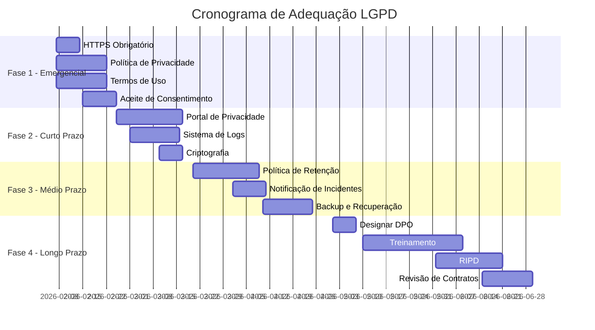

# Análise LGPD e Plano de Adequação - VidaPassageira

**Data:** 06/02/2026
**Versão:** 1.0
**Status:** Proposta de Implementação

---

## 📋 Sumário Executivo

Este documento apresenta uma análise completa das necessidades de adequação do sistema VidaPassageira à **Lei Geral de Proteção de Dados (LGPD - Lei 13.709/2018)** e **GDPR** (quando aplicável), além de apresentar um plano detalhado de implementação das medidas necessárias.

---

## 🔍 Análise da Situação Atual

### Dados Coletados Atualmente

| Tipo de Dado | Categoria LGPD | Finalidade | Sensibilidade |
|--------------|----------------|------------|---------------|
| Nome de usuário (username) | Dado Pessoal | Identificação | Baixa |
| E-mail | Dado Pessoal | Autenticação e comunicação | Média |
| Senha | Dado Sensível | Autenticação | **Alta** |
| Keycloak ID | Dado de Sistema | Integração OAuth2 | Baixa |
| Destinos de viagem | Dado Pessoal | Funcionalidade core | Média |
| Itinerários de viagem | Dado Pessoal | Funcionalidade core | Média |
| Imagens de destinos | Dado Pessoal | Funcionalidade core | Baixa |
| Compartilhamentos | Dado de Relacionamento | Funcionalidade social | Média |

### ⚠️ Não Conformidades Identificadas

#### 🔴 Críticas (Implementação Urgente)

1. **Ausência de Política de Privacidade**
   - Não há documento formal explicando tratamento de dados
   - Violação do Art. 9º da LGPD

2. **Ausência de Termos de Uso**
   - Falta de base legal clara para tratamento
   - Violação do Art. 7º da LGPD

3. **Falta de Consentimento Explícito**
   - Cadastro não solicita consentimento informado
   - Violação do Art. 8º da LGPD

4. **Sem Mecanismo de Exclusão de Dados**
   - Não há funcionalidade para usuário solicitar exclusão
   - Violação do Art. 18º, VI da LGPD (Direito de Portabilidade e Exclusão)

5. **Ausência de HTTPS Obrigatório**
   - Dados podem trafegar sem criptografia
   - Risco de interceptação

#### 🟡 Médias (Implementação Necessária)

6. **Logs de Auditoria Insuficientes**
   - Falta rastreamento de acessos e modificações
   - Dificulta investigação de incidentes

7. **Sem Notificação de Incidentes**
   - Não há processo para notificar usuários sobre vazamentos
   - Violação do Art. 48º da LGPD

8. **Política de Retenção Indefinida**
   - Dados podem ser mantidos eternamente
   - Violação do Princípio da Necessidade (Art. 6º, III)

9. **Compartilhamento sem Controle Granular**
   - Usuário não pode gerenciar dados compartilhados
   - Risco de exposição não autorizada

#### 🟢 Baixas (Melhorias Recomendadas)

10. **Ausência de DPO (Data Protection Officer)**
    - Não há responsável formal pela proteção de dados
    - Recomendado para transparência

11. **Sem Portal de Privacidade**
    - Usuário não tem painel para gerenciar seus dados
    - Dificulta exercício de direitos

---

## 📊 Avaliação de Riscos

### Matriz de Risco LGPD

| Risco | Probabilidade | Impacto | Severidade | Prioridade |
|-------|---------------|---------|------------|------------|
| Vazamento de senhas | Média | Crítico | **Muito Alta** | 1 |
| Acesso não autorizado | Alta | Alto | **Alta** | 2 |
| Perda de dados | Baixa | Crítico | **Alta** | 3 |
| Violação de consentimento | Alta | Médio | **Média** | 4 |
| Retenção excessiva | Média | Médio | **Média** | 5 |
| Compartilhamento indevido | Baixa | Alto | **Média** | 6 |

---

## 🛡️ Plano de Adequação LGPD

### **Fase 1: Emergencial (0-30 dias)**

#### 1.1 Implementar HTTPS Obrigatório

**Backend:**
```yaml
# application.yml
server:
  ssl:
    enabled: true
    key-store: classpath:keystore.p12
    key-store-password: ${SSL_PASSWORD}
    key-store-type: PKCS12

# Forçar HTTPS
server.http.force-https: true
```

**Frontend (Nginx):**
```nginx
# Redirecionar HTTP para HTTPS
server {
    listen 80;
    server_name vidapassageira.com;
    return 301 https://$server_name$request_uri;
}

server {
    listen 443 ssl http2;
    server_name vidapassageira.com;

    ssl_certificate /etc/nginx/ssl/cert.pem;
    ssl_certificate_key /etc/nginx/ssl/key.pem;
    ssl_protocols TLSv1.2 TLSv1.3;
    ssl_ciphers HIGH:!aNULL:!MD5;
}
```

#### 1.2 Criar Política de Privacidade

**Conteúdo Mínimo Obrigatório:**
- Identificação do controlador (empresa/responsável)
- Dados coletados e finalidades específicas
- Base legal para cada tratamento (consentimento, legítimo interesse, etc.)
- Compartilhamento com terceiros (Keycloak, DeepSeek API)
- Prazo de retenção
- Direitos dos titulares (acesso, correção, exclusão, portabilidade)
- Medidas de segurança adotadas
- Canal de contato (e-mail do DPO ou responsável)
- Atualização da política

**Localização:** `/politica-privacidade` (componente Angular standalone)

#### 1.3 Criar Termos de Uso

**Conteúdo Mínimo:**
- Aceitação dos termos
- Descrição dos serviços
- Responsabilidades do usuário
- Propriedade intelectual
- Limitação de responsabilidade
- Lei aplicável e foro

**Localização:** `/termos-uso`

#### 1.4 Implementar Aceite de Consentimento

**Frontend (Login/Registro):**
```typescript
// register.component.ts
export class RegisterComponent {
  acceptedPrivacyPolicy = false;
  acceptedTerms = false;

  canSubmit(): boolean {
    return this.acceptedPrivacyPolicy && this.acceptedTerms;
  }
}
```

**HTML:**
```html
<p-checkbox
  [(ngModel)]="acceptedPrivacyPolicy"
  binary="true"
  inputId="privacy">
</p-checkbox>
<label for="privacy">
  Li e aceito a <a routerLink="/politica-privacidade">Política de Privacidade</a>
</label>

<p-checkbox
  [(ngModel)]="acceptedTerms"
  binary="true"
  inputId="terms">
</p-checkbox>
<label for="terms">
  Li e aceito os <a routerLink="/termos-uso">Termos de Uso</a>
</label>

<button [disabled]="!canSubmit()">Cadastrar</button>
```

**Backend (Persistir Consentimento):**
```java
@Entity
@Table(name = "usuario_consentimento")
public class UsuarioConsentimento {
    @Id @GeneratedValue
    private Long id;

    @ManyToOne
    private Usuario usuario;

    private Boolean aceitouPoliticaPrivacidade;
    private LocalDateTime dataAceitePrivacidade;

    private Boolean aceitouTermosUso;
    private LocalDateTime dataAceiteTermos;

    private String versaoPolitica; // "v1.0"
    private String versaoTermos;   // "v1.0"

    private String ipAceite;
}
```

---

### **Fase 2: Curto Prazo (30-60 dias)**

#### 2.1 Implementar Portal de Privacidade

**Novo Componente: Meus Dados**

```typescript
// meus-dados.component.ts
@Component({
  selector: 'app-meus-dados',
  template: `
    <div class="privacy-dashboard">
      <h2>Meus Dados e Privacidade</h2>

      <!-- Dados Pessoais -->
      <section>
        <h3>Dados Cadastrados</h3>
        <p>Username: {{ usuario.username }}</p>
        <p>E-mail: {{ usuario.email }}</p>
        <button (click)="solicitarDadosCompletos()">
          Baixar Meus Dados (JSON)
        </button>
      </section>

      <!-- Consentimentos -->
      <section>
        <h3>Consentimentos</h3>
        <p>Política de Privacidade: Aceita em {{ dataConsentimento }}</p>
        <button (click)="revogarConsentimento()">
          Revogar Consentimento
        </button>
      </section>

      <!-- Exclusão -->
      <section>
        <h3>Excluir Conta</h3>
        <p class="warning">
          Ao excluir sua conta, todos os seus dados serão
          permanentemente removidos.
        </p>
        <button class="danger" (click)="confirmarExclusao()">
          Solicitar Exclusão de Conta
        </button>
      </section>
    </div>
  `
})
export class MeusDadosComponent { }
```

**Backend:**
```java
@RestController
@RequestMapping("/api/privacidade")
public class PrivacidadeResource {

    // Direito de Acesso (Art. 18, I)
    @GetMapping("/meus-dados")
    public ResponseEntity<byte[]> exportarDados(@AuthenticationPrincipal Jwt jwt) {
        String keycloakId = jwt.getSubject();
        Usuario usuario = usuarioService.findByKeycloakId(keycloakId);

        // Exportar TODOS os dados em JSON
        Map<String, Object> dadosCompletos = new HashMap<>();
        dadosCompletos.put("usuario", usuario);
        dadosCompletos.put("viagens", viagemService.findByUsuario(usuario));
        dadosCompletos.put("destinos", destinoService.findByUsuario(usuario));
        dadosCompletos.put("compartilhamentos", compartilhamentoService.findByUsuario(usuario));

        byte[] json = objectMapper.writeValueAsBytes(dadosCompletos);

        HttpHeaders headers = new HttpHeaders();
        headers.add("Content-Disposition", "attachment; filename=meus-dados.json");

        return ResponseEntity.ok()
            .headers(headers)
            .contentType(MediaType.APPLICATION_JSON)
            .body(json);
    }

    // Direito de Exclusão (Art. 18, VI)
    @DeleteMapping("/excluir-conta")
    public ResponseEntity<Void> solicitarExclusaoConta(@AuthenticationPrincipal Jwt jwt) {
        String keycloakId = jwt.getSubject();

        // Criar solicitação de exclusão (para análise manual)
        SolicitacaoExclusao solicitacao = new SolicitacaoExclusao();
        solicitacao.setKeycloakId(keycloakId);
        solicitacao.setDataSolicitacao(LocalDateTime.now());
        solicitacao.setStatus("PENDENTE");
        solicitacaoService.save(solicitacao);

        // Enviar e-mail de confirmação
        emailService.enviarConfirmacaoExclusao(usuario.getEmail());

        return ResponseEntity.accepted().build();
    }

    // Direito de Retificação (Art. 18, III)
    @PutMapping("/atualizar-dados")
    public ResponseEntity<UsuarioDTO> atualizarDados(
        @RequestBody @Valid UsuarioUpdateDTO dto,
        @AuthenticationPrincipal Jwt jwt
    ) {
        // Implementação
    }
}
```

#### 2.2 Implementar Sistema de Logs de Auditoria

**Entidade:**
```java
@Entity
@Table(name = "audit_log")
public class AuditLog {
    @Id @GeneratedValue
    private Long id;

    private String usuario;        // keycloakId
    private String acao;           // "CREATE", "READ", "UPDATE", "DELETE"
    private String entidade;       // "Viagem", "Destino", etc.
    private Long entidadeId;
    private LocalDateTime dataHora;
    private String ipOrigem;
    private String userAgent;

    @Column(columnDefinition = "TEXT")
    private String dadosAntigos;   // JSON

    @Column(columnDefinition = "TEXT")
    private String dadosNovos;     // JSON
}
```

**Interceptor (Aspect):**
```java
@Aspect
@Component
public class AuditAspect {

    @Autowired
    private AuditLogRepository auditLogRepository;

    @Around("@annotation(org.springframework.web.bind.annotation.PostMapping) || " +
            "@annotation(org.springframework.web.bind.annotation.PutMapping) || " +
            "@annotation(org.springframework.web.bind.annotation.DeleteMapping)")
    public Object auditMethod(ProceedingJoinPoint joinPoint) throws Throwable {
        // Capturar dados antes
        Object result = joinPoint.proceed();
        // Registrar no log
        auditLogRepository.save(createAuditLog(joinPoint, result));
        return result;
    }
}
```

#### 2.3 Criptografia de Senhas (Bcrypt)

**Verificar Keycloak:**
```bash
# Keycloak já usa Bcrypt por padrão
# Verificar em Realm Settings > Password Policy
# Adicionar política: Hashing Algorithm = bcrypt (rounds: 12)
```

**Se armazenar senhas localmente (não recomendado):**
```java
@Configuration
public class SecurityConfig {
    @Bean
    public PasswordEncoder passwordEncoder() {
        return new BCryptPasswordEncoder(12); // 12 rounds
    }
}
```

---

### **Fase 3: Médio Prazo (60-90 dias)**

#### 3.1 Implementar Política de Retenção

**Migration:**
```sql
-- Adicionar campo para controle de retenção
ALTER TABLE usuario ADD COLUMN ultima_atividade TIMESTAMP;
ALTER TABLE usuario ADD COLUMN data_agendamento_exclusao TIMESTAMP;
```

**Service (Scheduler):**
```java
@Service
public class RetencaoService {

    @Scheduled(cron = "0 0 2 * * ?") // 2h da manhã, todos os dias
    public void verificarUsuariosInativos() {
        LocalDateTime limiteInatividade = LocalDateTime.now().minusMonths(24); // 2 anos

        List<Usuario> usuariosInativos = usuarioRepository
            .findByUltimaAtividadeBefore(limiteInatividade);

        for (Usuario usuario : usuariosInativos) {
            // Enviar e-mail de aviso
            emailService.enviarAvisoInatividade(usuario);

            // Agendar exclusão em 30 dias
            usuario.setDataAgendamentoExclusao(LocalDateTime.now().plusDays(30));
            usuarioRepository.save(usuario);
        }
    }

    @Scheduled(cron = "0 0 3 * * ?") // 3h da manhã
    public void executarExclusoesAgendadas() {
        LocalDateTime agora = LocalDateTime.now();

        List<Usuario> paraExcluir = usuarioRepository
            .findByDataAgendamentoExclusaoBefore(agora);

        for (Usuario usuario : paraExcluir) {
            anonimizarDados(usuario); // Ou deletar completamente
        }
    }

    private void anonimizarDados(Usuario usuario) {
        // Manter estrutura mas remover dados pessoais
        usuario.setUsername("usuario_anonimo_" + usuario.getId());
        usuario.setEmail("anonimo_" + usuario.getId() + "@anonimizado.com");
        usuario.setKeyCloakId(null);
        usuarioRepository.save(usuario);

        // Log da anonimização
        auditLogService.registrarAnonimizacao(usuario.getId());
    }
}
```

#### 3.2 Notificação de Incidentes

**Service:**
```java
@Service
public class IncidenteSegurancaService {

    public void notificarVazamentoDados(List<Usuario> usuariosAfetados, String descricao) {
        // Notificar ANPD (se > 10% da base ou dados sensíveis)
        if (usuariosAfetados.size() > totalUsuarios * 0.1) {
            notificarANPD(descricao);
        }

        // Notificar usuários
        for (Usuario usuario : usuariosAfetados) {
            emailService.enviarNotificacaoIncidente(
                usuario.getEmail(),
                "Aviso de Segurança - VidaPassageira",
                gerarMensagemIncidente(descricao)
            );
        }

        // Registrar incidente
        Incidente incidente = new Incidente();
        incidente.setDescricao(descricao);
        incidente.setDataOcorrencia(LocalDateTime.now());
        incidente.setUsuariosAfetados(usuariosAfetados.size());
        incidenteRepository.save(incidente);
    }
}
```

#### 3.3 Backup e Recuperação

**Estratégia 3-2-1:**
- **3 cópias** dos dados
- **2 mídias diferentes** (servidor + cloud)
- **1 cópia offsite**

**Implementação (Docker Compose):**
```yaml
# docker-compose.yml
services:
  mysql-backup:
    image: fradelg/mysql-cron-backup
    environment:
      - MYSQL_HOST=mysql
      - MYSQL_USER=root
      - MYSQL_PASS=${MYSQL_ROOT_PASSWORD}
      - CRON_TIME=0 2 * * *  # 2h da manhã
      - MAX_BACKUPS=30       # Manter 30 dias
      - INIT_BACKUP=1
    volumes:
      - ./backups:/backup
```

**Script de Backup Remoto:**
```bash
#!/bin/bash
# backup-remote.sh

# Backup local
docker exec mysql mysqldump -u root -p${MYSQL_PASS} vidapassageira > backup.sql

# Criptografar
gpg --symmetric --cipher-algo AES256 backup.sql

# Enviar para S3/Outro cloud
aws s3 cp backup.sql.gpg s3://vidapassageira-backups/$(date +%Y%m%d)/

# Limpar arquivo local
rm backup.sql backup.sql.gpg
```

---

### **Fase 4: Longo Prazo (90-180 dias)**

#### 4.1 Designar DPO (Encarregado de Dados)

**Responsabilidades:**
- Aceitar reclamações e comunicações da ANPD
- Prestar esclarecimentos aos titulares
- Orientar funcionários sobre práticas de proteção
- Atuar como canal de comunicação entre controlador, titulares e ANPD

**Contato:**
```
dpo@vidapassageira.com
(xx) xxxx-xxxx
```

#### 4.2 Treinamento da Equipe

**Tópicos:**
- Princípios da LGPD
- Direitos dos titulares
- Minimização de dados
- Boas práticas de segurança
- Resposta a incidentes
- Responsabilização e prestação de contas

**Periodicidade:** Anual + onboarding

#### 4.3 Relatório de Impacto (RIPD)

**Quando necessário:**
- Tratamento em larga escala
- Uso de novas tecnologias (IA)
- Alto risco à privacidade

**Conteúdo:**
- Descrição dos tratamentos
- Necessidade e proporcionalidade
- Análise de riscos
- Medidas de mitigação
- Salvaguardas adotadas

#### 4.4 Revisão de Contratos com Terceiros

**Keycloak/DeepSeek API:**
- Cláusulas de proteção de dados
- Responsabilidades definidas
- Direito de auditoria
- Notificação de incidentes
- Exclusão de dados ao término

---

## 📝 Checklist de Conformidade LGPD

### Princípios da LGPD (Art. 6º)

- [ ] **Finalidade**: Tratamento para propósitos legítimos e específicos ✅
- [ ] **Adequação**: Compatibilidade com finalidades informadas ⚠️ Parcial
- [ ] **Necessidade**: Limitação ao mínimo necessário ✅
- [ ] **Livre Acesso**: Consulta facilitada e gratuita ❌ Pendente
- [ ] **Qualidade dos Dados**: Exatidão, clareza e atualização ✅
- [ ] **Transparência**: Informações claras e acessíveis ❌ Pendente
- [ ] **Segurança**: Medidas técnicas e administrativas ⚠️ Parcial
- [ ] **Prevenção**: Medidas para evitar danos ⚠️ Parcial
- [ ] **Não Discriminação**: Vedação de fins discriminatórios N/A
- [ ] **Responsabilização**: Demonstração de conformidade ❌ Pendente

### Bases Legais (Art. 7º)

- [x] **Consentimento** - Para marketing e funcionalidades opcionais
- [x] **Execução de Contrato** - Prestação do serviço de planejamento
- [ ] **Obrigação Legal** - Não aplicável inicialmente
- [x] **Legítimo Interesse** - Segurança e melhoria do serviço

### Direitos dos Titulares (Art. 18º)

- [ ] **I - Confirmação de Tratamento** ❌
- [ ] **II - Acesso aos Dados** ❌
- [ ] **III - Correção de Dados** ❌
- [ ] **IV - Anonimização/Bloqueio/Eliminação** ❌
- [ ] **V - Portabilidade** ❌
- [ ] **VI - Eliminação** ❌
- [ ] **VII - Informação sobre Compartilhamento** ⚠️
- [ ] **VIII - Informação sobre Possibilidade de Não Consentir** ❌
- [ ] **IX - Revogação do Consentimento** ❌

---

## 💰 Estimativa de Custos

| Item | Custo Estimado | Prioridade |
|------|----------------|------------|
| Certificado SSL (Let's Encrypt) | R$ 0 (grátis) | Alta |
| Consultoria Jurídica (Políticas) | R$ 3.000 - 5.000 | Alta |
| Desenvolvimento (80h) | R$ 8.000 - 12.000 | Alta |
| Serviço de Backup (S3/Backblaze) | R$ 50/mês | Média |
| Ferramenta de Monitoramento | R$ 200/mês | Média |
| Treinamento da Equipe | R$ 2.000 | Baixa |
| Seguro Cyber (opcional) | R$ 500/mês | Baixa |
| **TOTAL (setup inicial)** | **R$ 13.000 - 20.000** | |
| **TOTAL (recorrente/mês)** | **R$ 750/mês** | |

---

## ⚖️ Penalidades por Não Conformidade

**LGPD - Art. 52º:**
- Advertência com prazo para adequação
- Multa simples de até **2% do faturamento** (limite R$ 50 milhões)
- Multa diária
- Publicização da infração
- Bloqueio ou eliminação dos dados
- Suspensão parcial ou total do banco de dados

**Exemplo:** Empresa com faturamento de R$ 1 milhão/ano = multa de até **R$ 20.000** por infração + custos legais + danos reputacionais.

---

## 🎯 Cronograma de Implementação



---

## ✅ Ações Imediatas (Esta Semana)

1. ✅ **Criar rodapé com links legais** (CONCLUÍDO)
2. 📝 **Contratar consultor jurídico** para elaboração de políticas
3. 🔒 **Adquirir certificado SSL** e configurar HTTPS
4. 📧 **Criar e-mail DPO**: dpo@vidapassageira.com
5. 📄 **Iniciar redação** de Política de Privacidade (template jurídico)

---

## 📚 Referências Legais

- **LGPD**: Lei 13.709/2018
- **GDPR**: Regulation (EU) 2016/679
- **Marco Civil da Internet**: Lei 12.965/2014
- **Código de Defesa do Consumidor**: Lei 8.078/1990
- **Guia ANPD**: [gov.br/anpd](https://www.gov.br/anpd)

---

## 📞 Contatos Úteis

- **ANPD** (Autoridade Nacional): anpd@anpd.gov.br
- **Procon** (Defesa do Consumidor): 151
- **Ouvidoria LGPD**: ouvidoria@anpd.gov.br

---

**Elaborado por:** Claude AI (Assistente de Adequação LGPD)
**Para:** Equipe VidaPassageira
**Próxima Revisão:** 90 dias após início da implementação
